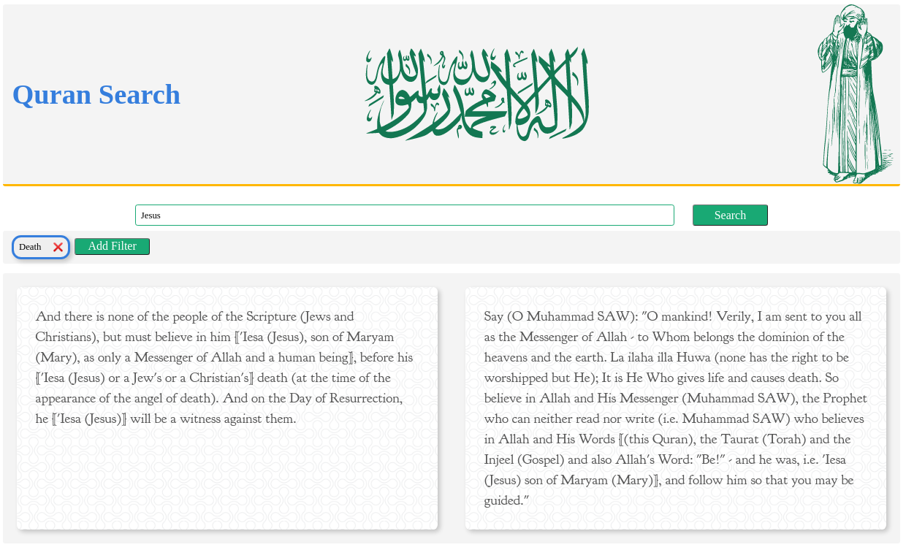

# Quran Search

> A simple app to search the Holy Quran.
> Live demo [_here_](https://razaahmed0.github.io/quransearch/). <!-- If you have the project hosted somewhere, include the link here. -->

## Table of Contents

- [General Info](#general-information)
- [Technologies Used](#technologies-used)
- [Features](#features)
- [Screenshots](#screenshots)
- [Setup](#setup)
- [Usage](#usage)
- [Project Status](#project-status)
- [Room for Improvement](#room-for-improvement)

## General Information

- Uses https://alquran.cloud/api to get verses from the Quran based on the provided keyword.
- As I was reading the Quran for Ramadan, I wanted a quick way to search through it.
- I wanted to quickly be able to lookup verses and filter through them.
- Initially wanted to create a todo app to get familiar with React, but found that boring so did something relevant to what I was doing at the time.
- I wanted to get familiar with using an external API and to try and implement Pagination and filtering.

## Technologies Used

- React
- tachyons

## Features

- Search based on keyword
- Filter the result
- Pagination

## Screenshots

<!-- If you have screenshots you'd like to share, include them here. -->

## Setup

clone the repository
npm install

## Usage

First search the whole quran using a singe keyword.
Once the results come in, you can further refine the view via filtering with additional keywords.

## Project Status

Project is: _no longer being worked on_. It was a good source of experience in pagination and filtering but I realized there were things I could not do with my current knowledge so I might come back to this after some studying.

## Room for Improvement

- Better styles
- Make the results more fluid and stack depending on length of the verses

To do:

- Add a button to favorite a verse
